# Go 整合 ECS Service Connect 與 LLM 實作 AIOps 自動化決策

## 時間地點

- 6 月 26 日 (五) 11:30 - 13:00 (607+608 會議室)

## 工作坊核心流程

1. **數據提取與分析**：使用 Go 抓取 CloudWatch 與 ECS 遙測資料（監控 Request/Error Rate/Latency）。
2. **AI 決策大腦**：串接 AWS Bedrock (LLM)，透過思考鏈 (CoT) 產出部署或回滾指令。
3. **基礎設施聯動**：透過 AWS SDK v2 for Go 調整 ECS Task 數量與 Service Connect 路由。
4. **混沌演練**：注入故障，觀察 AIOps 自動完成故障隔離與流量收斂。

## AWS Console 實作指南

> 💡 **操作前注意事項**
> 本工作坊全程使用 **Taipei (ap-east-2)** 區域。
> 請先檢查右上角的 **Region (區域)**，若您為不同區域，切換後請勿更換。

## ⓪ 前置準備：打包並推送映像檔到 ECR

- **為什麼要做這個？** 先把你本機的 Go 程式打包成容器映像檔，推到雲端倉庫（ECR）。後面 ECS 的任務定義（Task Definition）才有映像檔可以拉取。這一步是整個流程的源頭。

你在這裡用哪種 platform 打包（`amd64` 或 `arm64`），後面第任務定義的 **OS/Architecture** 就要選對應的（`amd64` → `Linux/X86_64`、`arm64` → `Linux/ARM64`），否則容器會啟動失敗。

### 建立 ECR Repository


1. **進入服務**：左上角搜尋欄輸入 `ECR` (Elastic Container Registry) 進入控制台。
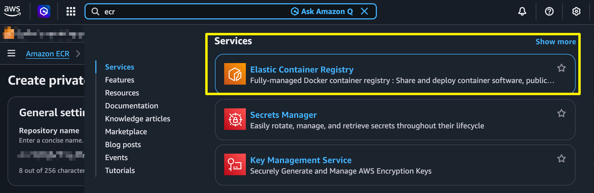

2. **建立倉庫**：若沒建立過，頁面會有 `Create a repository`，點選右上角橘色按鈕 `Create`。
3. **[General settings]**：輸入 **Repository name**：`demo-arm`。
4. 其他設定不動，點選右下角橘色按鈕 `Create`。
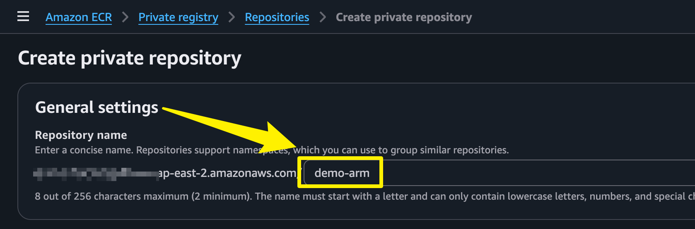

5. 列表上會出現剛建立的 `demo-arm`，點進去。
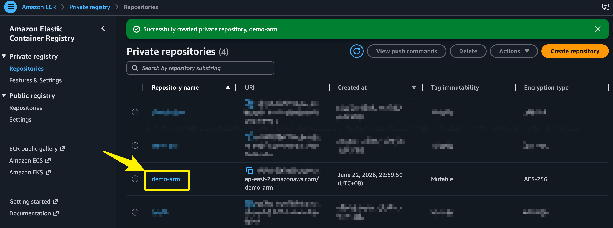

6. 進到 repo 內後，右上方點選 `View push commands`，會出現四個指令（左邊小方框可一鍵複製）。
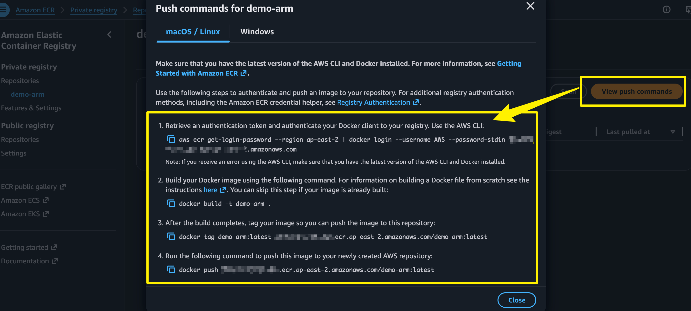

### 在本機推送映像檔

先開 terminal，在本專案根目錄， 進入到路徑 `workshop-sample` 層底下。

> **注意**：複製完後在自己的 terminal 貼上，**請不要直接 Enter**，每個指令都要先確認 / 修改。


**前置作業**

需要先登入 AWS SSO ，`AdministratorAccess-0xxxxxxx` 就是 <profile_name>
```
aws sso login --profile AdministratorAccess-0xxxxxxx
```

- profile 資訊會預設在本機根目錄，可另外開 terminal 輸入 `cat ~/.aws/config` 取得

範例
```
[profile <profile_name>] <--------- 取得這裡的 AdministratorAccess-0xxxxxxxxx
sso_session = sunny sso_account_id = 000000000
sso_role_name = AdministratorAccess [sso-session sunny] 
sso_start_url = https://d-11111111.awsapps.com/start/ 
sso_region = ap-east-2
sso_registration_scopes = sso:account:access
```


**指令 1：登入 ECR**

原始指令大概長這樣：

```sh
aws ecr get-login-password --region ap-east-2 | docker login --username AWS --password-stdin <account_id>.dkr.ecr.ap-east-2.amazonaws.com
```

要在 `|` 前面加上自己的 profile：

```sh
aws ecr get-login-password --region ap-east-2 --profile <profile_name> | docker login --username AWS --password-stdin <account_id>.dkr.ecr.ap-east-2.amazonaws.com
```

出現 `Login Succeeded` 就代表第一個指令 OK 了。

**指令 2：打包 image**

**這裡要修改原始指令 docker build -t demo-arm 請不要直接 Enter**，先依你的目標架構改寫 ：

- x86_64（amd64）：

```sh
  docker build --platform=linux/amd64 -t demo-arm .
```

- ARM（arm64）：

```sh
  docker build --platform=linux/arm64 -t demo-arm .
```

打包完成後，用以下指令確認列表上有 `demo-arm`：

```sh
docker images
```

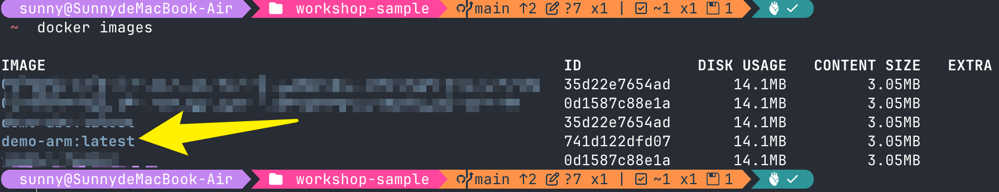

**指令 3：標記 tag**

上面指令成功後，請直接複製你畫面上的第 3 個指令貼上 Enter 即可。
範例格式 `docker tag demo-arm:latest <account_id>.dkr.ecr.ap-east-2.amazonaws.com/demo-arm:latest`

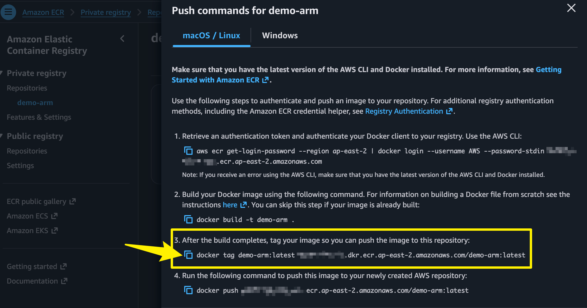


**指令 4：推送 push**

一樣複製你畫面上的第 4 個指令貼上 Enter 即可。
範例格式`docker push <account_id>.dkr.ecr.ap-east-2.amazonaws.com/demo-arm:latest`
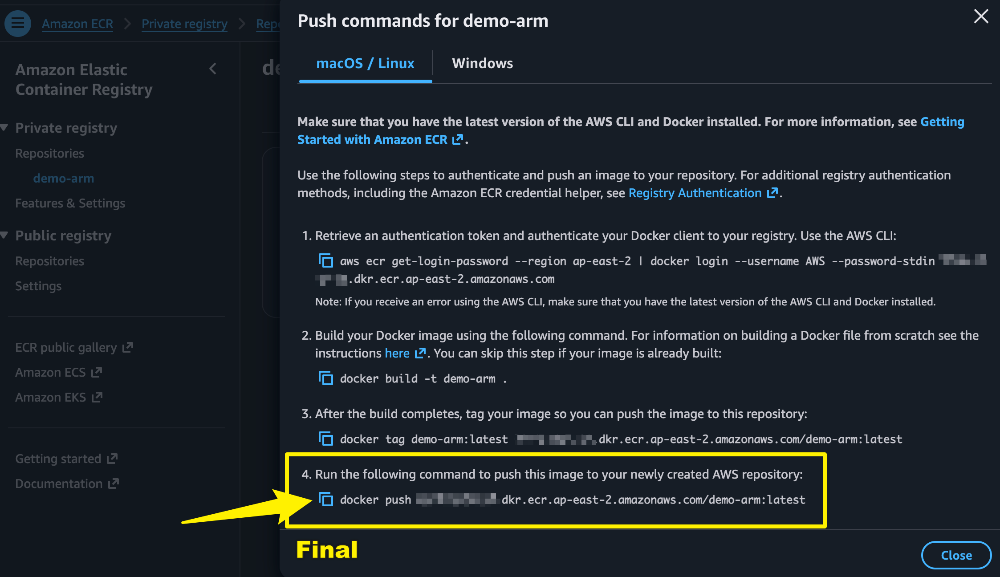


**重整畫面，記下 Image URI**

push 成功後回到 AWS ECR 頁面重整 ，列表上會看到映像檔項目，代表此步驟成功。


> 進到 `demo-arm` repo 內，會看到推上去的 image（**Type: Image，且有 Image Size**），這個就是後面任務定義要用的 **Image URI**，先記著它的位置，這個畫面先留著，不要關掉。

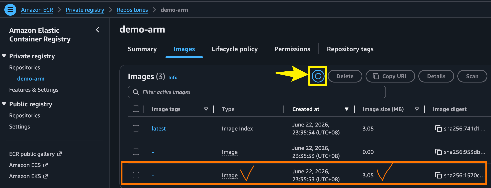

## ① 設定安全組 (Security Group)

- **為什麼要做這個？** 建立網路防火牆。`demo-sg` 負責擋下外網不合法的請求；`demo-ecs-sg` 負責確保只有來自負載均衡器（ALB）的流量才能進入 ECS 容器。

1. **進入服務**：上方搜尋欄輸入 `EC2` 進入控制台。
2. **尋找功能**：左側導覽列 `[Network & Security]` 點選 `Security Groups`。
3. **建立外網安全組 (demo-sg)**：點選右上角 `Create security group`。

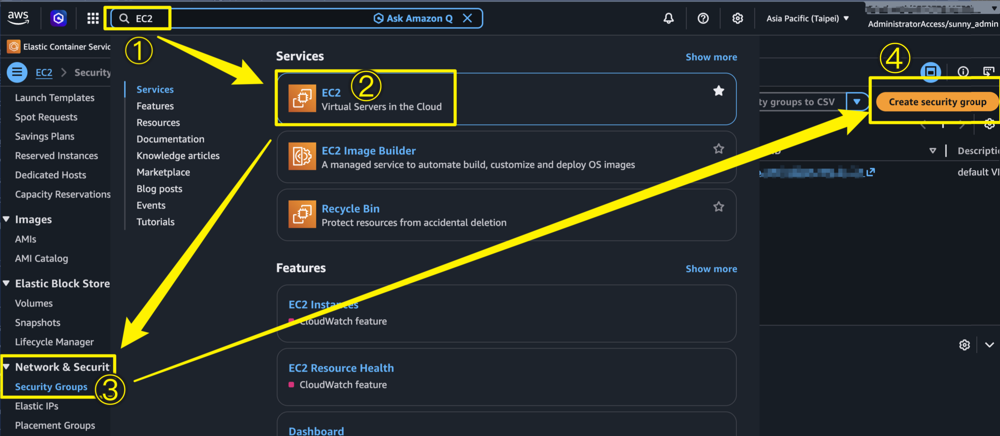


   - **[Basic details]**

     - Security group name: `demo-sg`
     - Description: `demo-sg`
     - VPC: 帶入預設值 (Default VPC)

   - **[Inbound rules]** (點擊 Add rule)

     - Type: `HTTP` | Port range: `80` | Source: `Anywhere-IPv4` (`0.0.0.0/0`)

   - **[Outbound rules]**：保持預設 (All traffic) 不動。
   
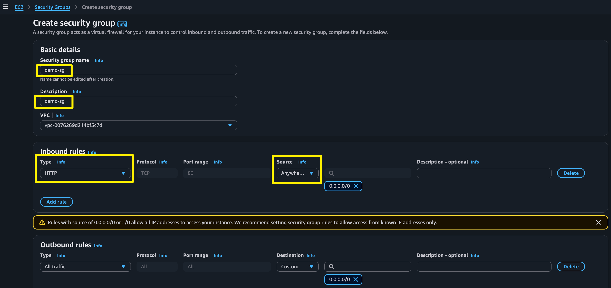
- **完成**：點擊右下角 `Create security group`。

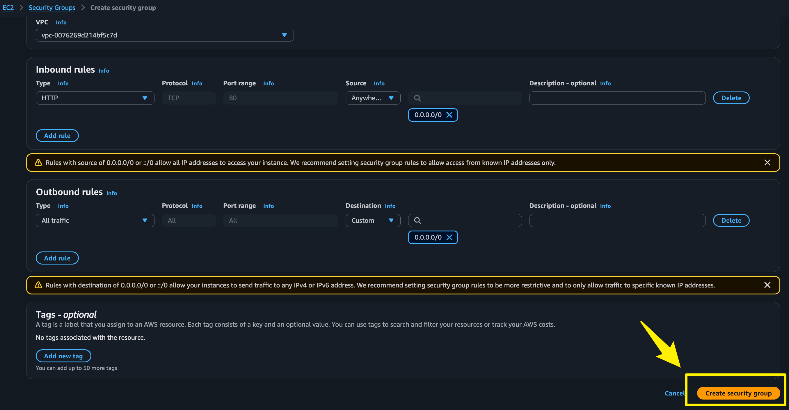

1. **建立容器安全組 (demo-ecs-sg)**：
    麵包屑點選  Security Groups ，再點選右上角 `Create security group`。
    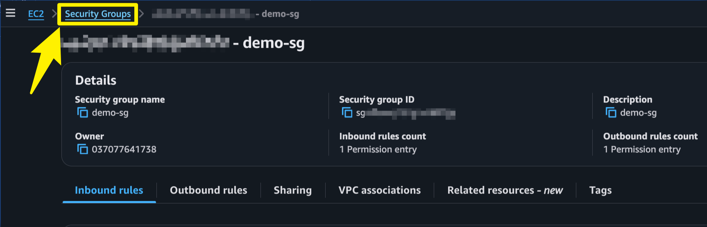
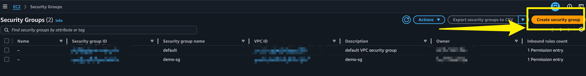

   - **[Basic details]**

     - Security group name: `demo-ecs-sg`
     - Description: `demo-ecs-sg`
     - VPC: 帶入預設值 (Default VPC)

   - **[Inbound rules]** (點擊 Add rule)

     - Type: `Custom TCP` | Port range: `8080` | Source: 點選輸入框，尋找並選擇剛建立的 `demo-sg`
   - **[Outbound rules]**：保持預設不動。

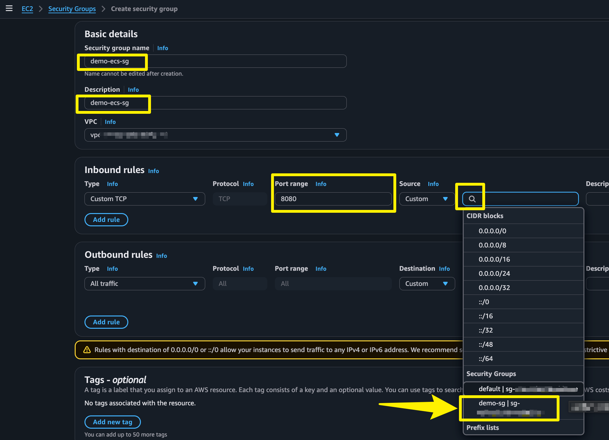
   
   - **完成**：點擊右下角 `Create security group`。


## ② 設定目標組 (Target Group)

- **為什麼要做這個？** 定義流量發送的「目的地」。
- 告訴負載均衡器（ALB）後端運行的容器在哪裡（IP 形式），以及如何檢查它們是否還活著（Health Check）。

1. **進入功能**：左側導覽列 `[Load Balancing]` 點選 `Target Groups`。
2. **開始建立**：點選右上角 `Create target group`。
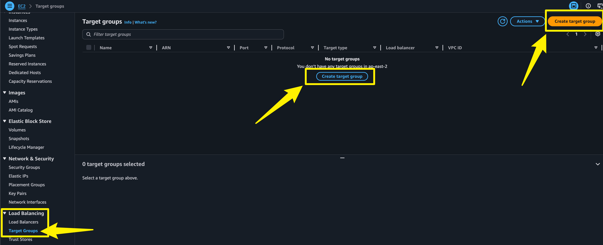


3. **[Step 1: Choose target type]**

   - Target type: 選擇 `IP addresses`
   - Target group name: `demo-tg`
   - Protocol: `HTTP` | Port: `8080`
   - IP address type: `IPv4`
   - VPC: 選擇預設 VPC
   - Protocol version: `HTTP1`
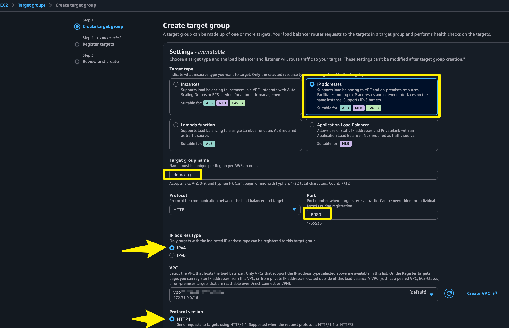

   - **[Health checks]**

     - Health check protocol: `HTTP`
     - Health check path: `/health` (後端程式提供的健康檢查路由)
   - **下一步**：點擊右下角 `Next`。
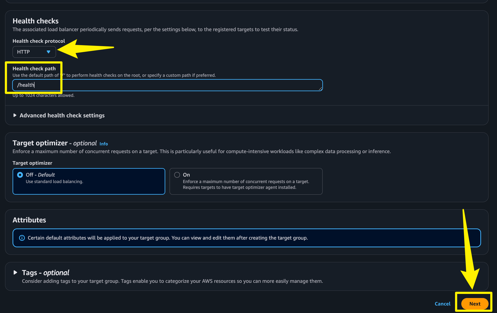

4. **[Step 2: Register targets]**：此處先不註冊任何 IP（後續由 ECS 自動註冊），直接點擊 `Next`。
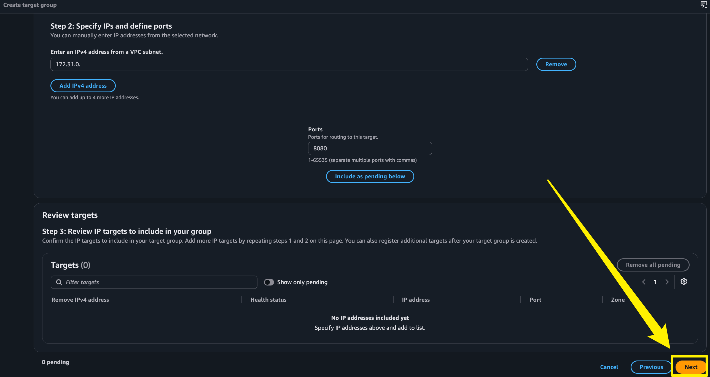

5. **[Step 3: Review and create]**：確認資訊無誤，點擊 `Create target group`。
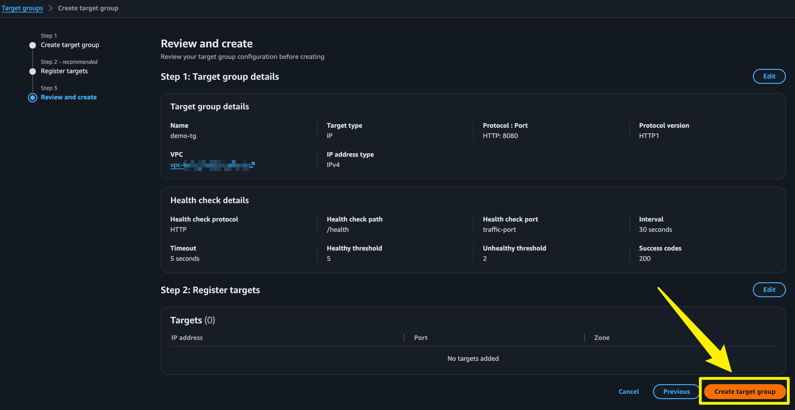


## ③ 設定應用程式負載均衡器 (ALB)

- **為什麼要做這個？** 建立單一入口。將對外的 HTTP 80 端口流量接收進來，再分流轉發給後方的目標組（Target Group）。

1. **進入功能**：左側導覽列 `[Load Balancing]` 點選 `Load Balancers`。
2. **開始建立**：點選右上角 `Create load balancer` -> 選擇 `Application Load Balancer` 點擊 `Create`。
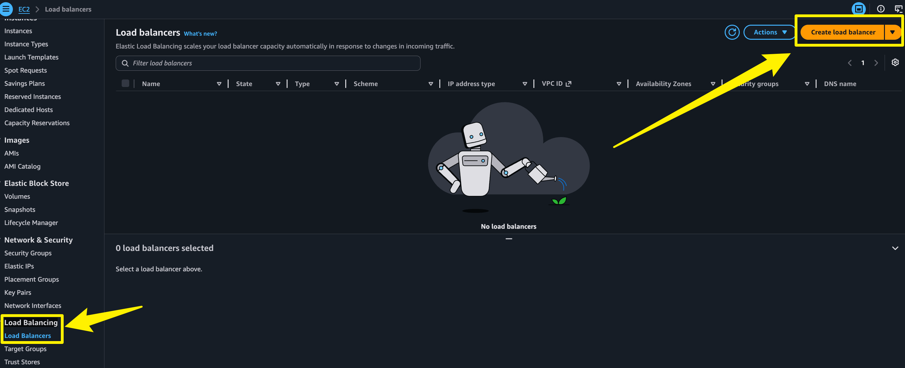

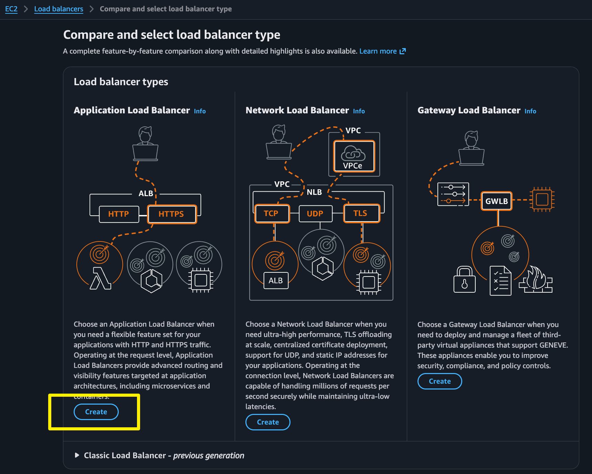


1. **配置參數**：

   - **[Basic configuration]**

     - Load balancer name: `demo-alb`
     - Scheme: `Internet-facing`
     - IP address type: `IPv4`
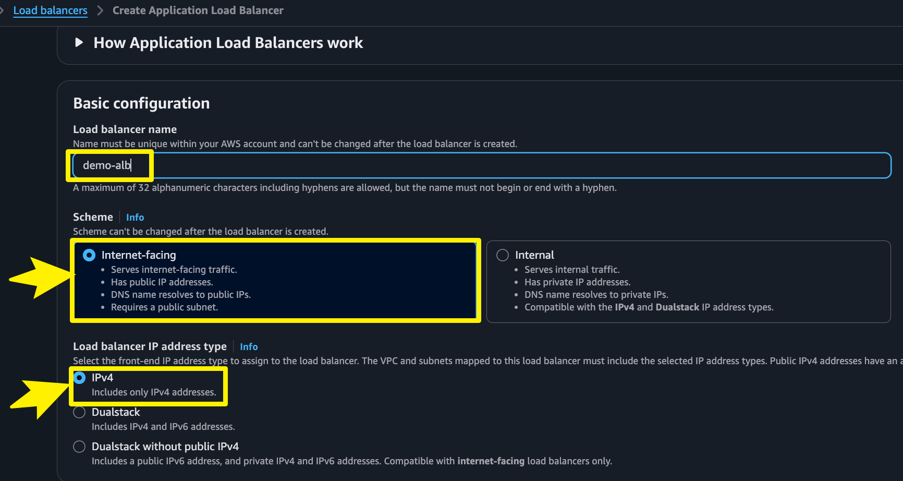


   - **[Network mapping]**

     - VPC: 選擇預設 VPC
     - Mappings: 將出現的所有 Subnets (可用區) **全部勾選** 有三個勾就對了。
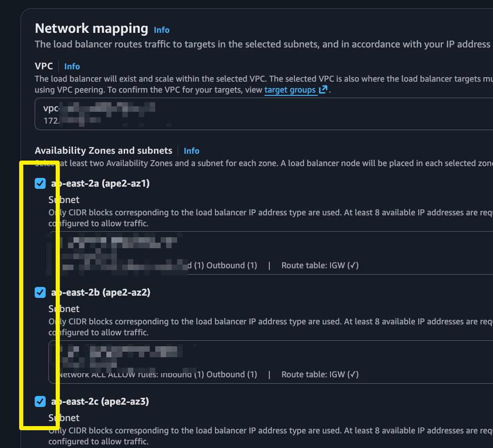
   
   - **[Security groups]**

     - 移除預設的 security group。
     - 點選下拉選單，選擇剛建立的 `demo-sg`。

   - **[Listeners and routing]**

     - Protocol: `HTTP` | Port: `80`
     - Default action: Forward to 選擇 `demo-tg`

1. **完成**：點擊右下角 `Create load balancer`。

## ④ 設定 AWS Cloud Map (服務發現命名空間)

- **為什麼要做這個？** 讓 ECS 服務之間不需要透過外網 ALB，直接用內部網域名稱（`workshop.local`）互相溝通。

1. **進入服務**：左上角搜尋欄輸入 `AWS Cloud Map`。
2. **建立命名空間**：點選右上角 `Create namespace`。
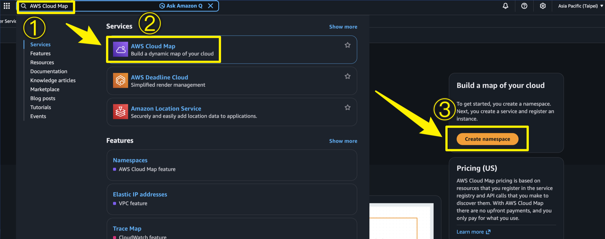

   - Namespace name: `workshop.local`
   - Description: 留空
   - Instance discovery: 選擇 `API calls and DNS queries in VPCs` (確保內網可解析)
   - VPC: 選擇預設 VPC
3. **完成**：點擊右下角 `Create namespace`。

## ⑤ 設定 ECS 集群 (Cluster)

- **為什麼要做這個？** 建立容器的虛擬資源池。管理後續要運行的任務與監控指標 (`Container Insights`)。

1. **進入服務**：左上角搜尋欄輸入 `Elastic Container Service` (ECS)。
2. **建立集群**：左側導覽列點選 `Clusters`，接著點擊右上角 `Create cluster`。
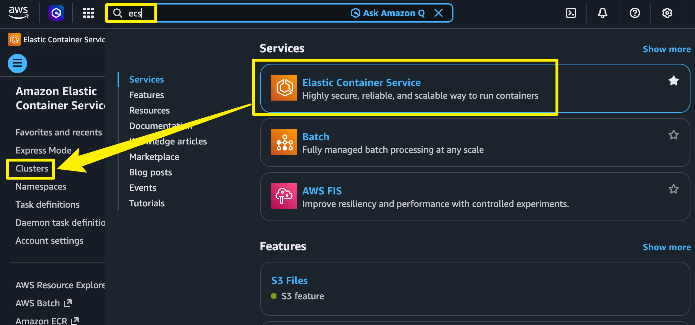
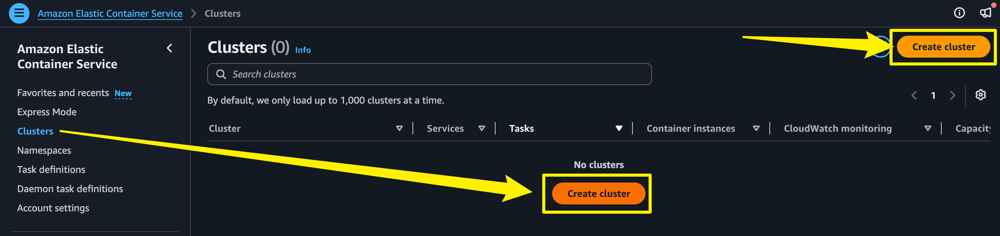
3. **配置參數**：

   - Cluster name: `demo-cluster`
   - **[Infrastructure]**：只選取 `Fargate only`  (serverless)。
   - **[Monitoring]**：只選取 `Container Insights` (用於收集 AIOps 決策所需的指標)。
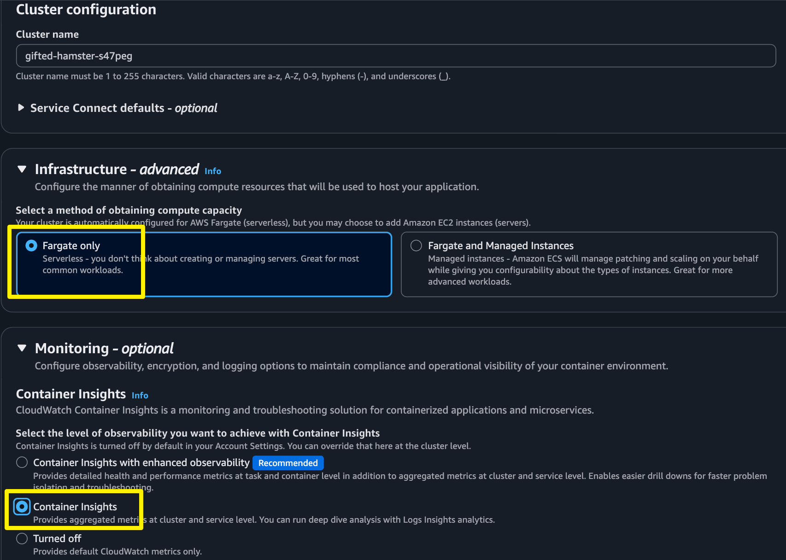

1. **完成**：點擊右下角 `Create`。

## ⑥ 設定任務定義 (Task Definition)

- **為什麼要做這個？** 定義這個 Go 程式需要多少 CPU、記憶體、使用哪張映像檔，以及環境變數（區分 Blue/Green 版本）。

### 配置 api-blue

1. 左側導覽列點選 `Task definitions` -> 點擊 `Create new task definition`。
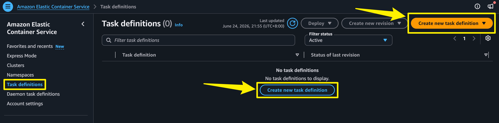

2. **[Task definition configuration]**

   - Task definition family: `api-blue`
   - Launch type: `✅️AWS Fargate`
   - OS/Architecture: `Linux/ARM64`
   - Task size: CPU `0.5 vCPU` | Memory `1 GB`
   - Task role / Task execution role: 選擇 `ecsTaskExecutionRole` (若無，系統會自動建立)
3. **[Container - 1]**

   - Name: `api`
   -  Essential container: `Yes`
   - Image URI: 貼上在 **ECR 複製的 Image URI**  或是點選 `Browse ECR images` 在 `Select Amazon ECR image` 的 `Images` 中點選對應的 ECR
	(另外開 ECR 分頁，複製 Type:image 而且 Image Size 不是 0.00 的 Image digest)
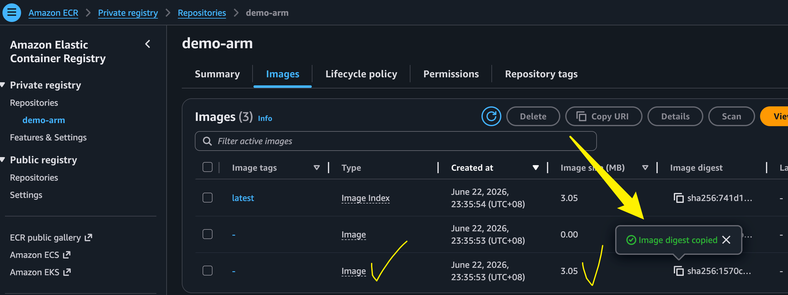
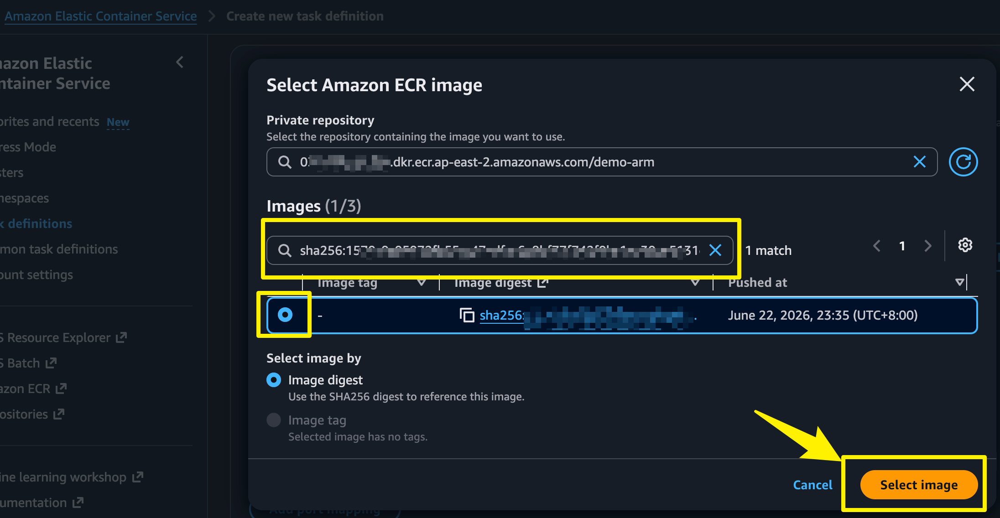
   
   
  
   - Port mappings: Container port `8080` | Protocol `TCP` | Port name `api-port`
4. **[Environment variables]** (點擊 Add environment variable)

   - 鍵值對 1：Key: `APP_VERSION` | Value: `blue`
   - 鍵值對 2：Key: `FAIL_RATE` | Value: `0`
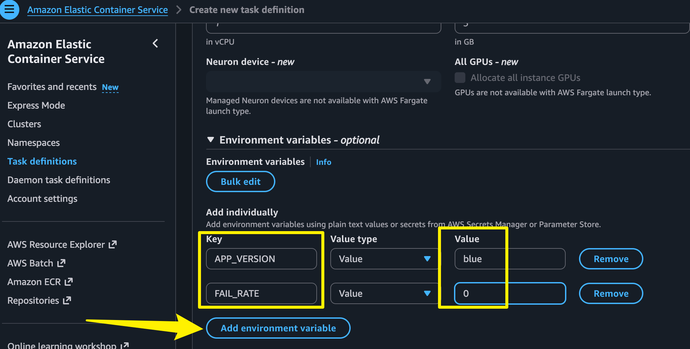


4. **[Log collection]**：勾選 Use log collection。

   - awslogs-group: `/ecs/sample-log`
   - awslogs-region: `ap-east-2`
   - awslogs-stream-prefix: `api-blue`
6. **完成**：點擊 `Create`。

### 配置 api-green

1. 再次點擊 `Create new task definition`。
2. 規格完全複製 `api-blue`，只修改以下三個欄位：

   - Task definition family: `api-green`
   - **[Environment variables]** -> `APP_VERSION` 修改為 `green`
   - **[Log collection]** -> awslogs-stream-prefix 修改為 `api-green`
3. **完成**：點擊 `Create`。

## ⑦ 調整 IAM 權限

- **為什麼要做這個？** 授權。預設執行角色能寫入既有日誌串流，但沒有「自動建立 Log Group」的權限。若不預先手動建立 `/ecs/sample-log`，任務會因無法建立群組而啟動失敗，AIOps 也就讀不到日誌。
- 
- 預設的 ECS 角色沒有寫入日誌的完整權限，必須允許它將容器日誌送到 CloudWatch Logs，AIOps 才能讀取分析。

1. 控制台搜尋 `IAM` -> 左側導覽列點選 `Roles`。
2. 搜尋欄輸入 `ecsTaskExecutionRole` 並點擊進入。
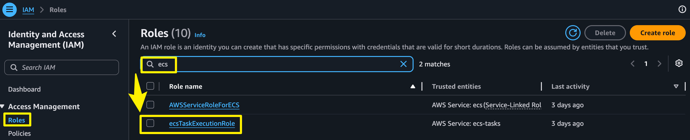


3. 在 `[Permissions policies]` 頁籤中，點擊右側 `Add permissions` -> 選擇 `Attach policies`。
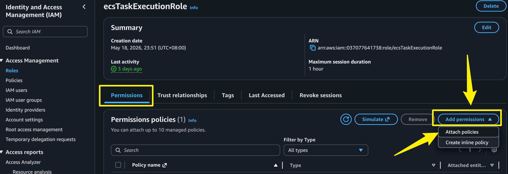


4. 搜尋欄輸入 `CloudWatchLogsFullAccess`，勾選該策略。
5. 點擊右下角 `Add permissions` 完成授權。
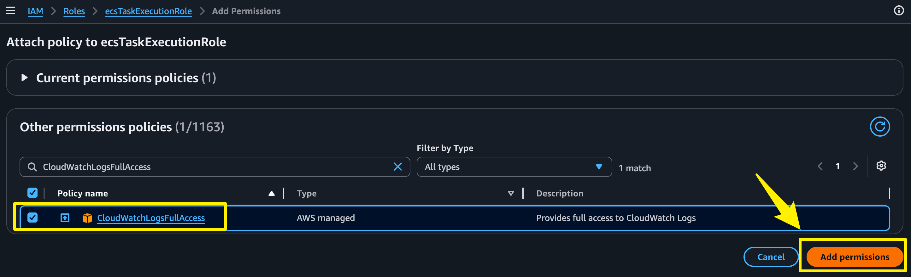
## ⑧ 創建服務並啟動 Service Connect

- **為什麼要做這個？** 讓容器真正跑起來。Service 會維持指定的 Task 數量，並透過 Service Connect 注入 Sidecar 代理，接管服務間的微服務路由與遙測。

### 啟動 api-blue 服務

1. 回到 `ECS` -> 點選 `Clusters` -> 進入 `demo-cluster`。
2. 在 `[Services]` 頁籤中，點擊右側 `Create`。
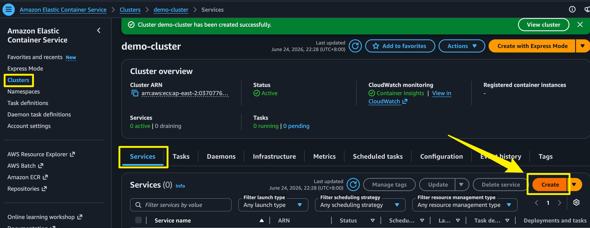

3. **[Environment]**
   - Compute options: `Launch type` | Launch type: `Fargate`
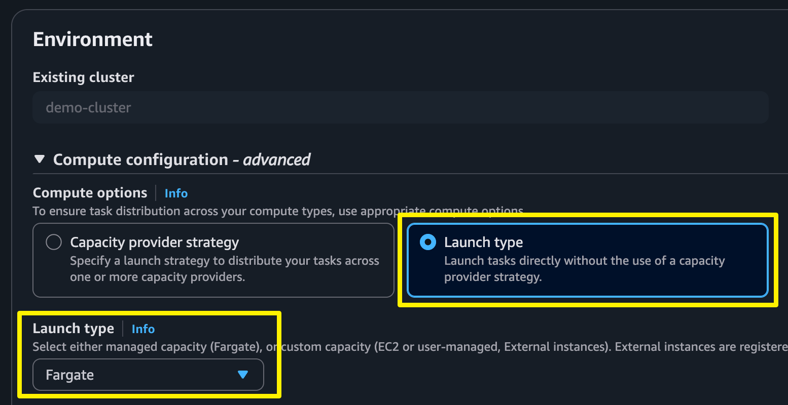


4. **[Deployment configuration]**

   - Application type: `Service`
   - Task definition -> Family: 選擇 `api-blue` | Revision: 選擇最新版本
   - Service name: `api-blue-service`
   - Desired tasks: `2` (啟動兩個實例)

5. **[Networking]**

   - VPC / Subnets: 保持預設
   - Security group: 移除預設，選擇剛建立的 `demo-ecs-sg`

6. **[Service Connect]** ⭐️ _核心設定_

   - 勾選 `Turn on Service Connect`
   - Service Connect configuration: 選擇 `Client and server`
   - Namespace: 選擇 `workshop.local`

   - **[Service Connect services]**

     - Port alias: `api-port`
     - Discovery optional: `api-blue`
     - DNS name: `api-blue` | Port: `8080`
7. **[Load balancing]**

   - Load balancer type: `Application Load Balancer`
   - Load balancer: 選擇 `demo-alb`
   - Listener: 選擇 `Use an existing listener` -> `HTTP:80`
   - Target group: 選擇 `Use an existing target group` -> `demo-tg`
8. **完成**：點擊底部 `Create`。

### 啟動 api-green 服務

1. 再次於 `demo-cluster` 的 `[Services]` 頁籤點擊 `Create`。
2. 配置與 `api-blue` 相同，僅修改以下變更欄位：

   - Task definition -> Family: 選擇 `api-green`
   - Service name: `api-green-service`
   - Desired tasks: `1`
   - **[Service Connect services]**

     - Port alias: `api-port`
     - Discovery optional: `api-green`
     - DNS name: `api-green` | Port: `8080`
   - **[Load balancing]**：**不勾選 / 選擇 None**（Green 版本初始不對外開放，僅透過 Service Connect 供內部測試）。
3. **完成**：點擊底部 `Create`。

## ⑨ 驗證架構

- **為什麼要做這個？** 確保入口與路徑暢通。

1. 進入 `EC2` 控制台 -> 左側 `Load Balancers` -> 點選 `demo-alb`。
2. 複製右側的 **DNS name** (類似格式 `demo-alb-12345.ap-east-2.elb.amazonaws.com`)。
3. 在瀏覽器或終端機執行：

```bash
curl http://[你的ALB_DNS_NAME]
```

4. **預期結果**：此時流量應全數導向 `api-blue`，回應內容會顯示 `{"version": "blue"}`。架構已就緒，準備進入 Go 與 AI 決策鏈實作。
